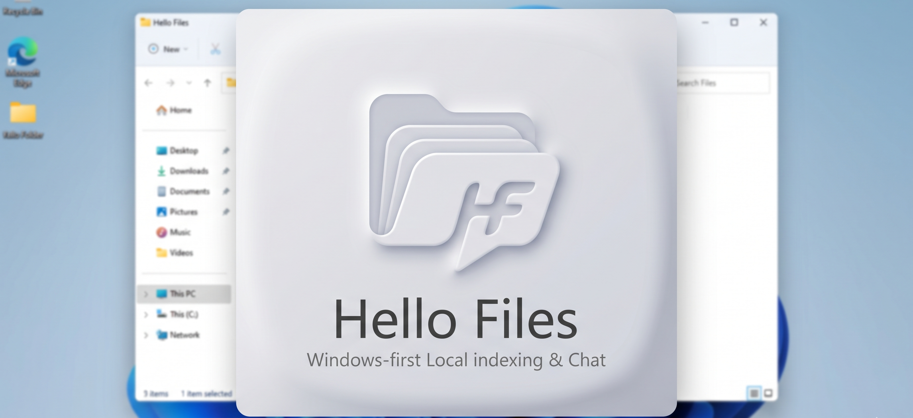

# Hello Files



Windows-first desktop app for indexing local folders and chatting against their contents.

The project combines an Electron desktop shell, a React UI, SQLite app state, and a Python indexing worker that extracts text, builds embeddings, and stores a local searchable index beside the source folder.

## Why This Exists

Hello Files is built for cases where the source of truth lives in files, not in a database or a hosted knowledge base.

Examples:

- project documentation spread across folders
- operating procedures and internal manuals
- mixed document sets with PDFs, Word files, spreadsheets, images, and code/config files
- local-first experiments with Ollama or other model providers

## Current Status

This project is functional, but still early. It is best described as an actively evolving desktop prototype rather than a polished production product.

Areas that are still improving:

- long-running indexing and large-folder performance
- clearer recovery from provider or filesystem errors
- broader test coverage and contributor-facing docs

## Features

- Create channels backed by local folders
- Index local files into a `.fschat-index/` directory inside the source folder
- Chat against indexed content with citations back to source files
- Use reusable provider connections instead of hardcoded single-provider profiles
- Choose explicit chat and embedding models per channel
- Rebuild incrementally when files are unchanged
- Track both indexed files and failed files in the UI
- Use OCR for standalone images and image-heavy documents when useful

## Supported Providers

- OpenAI
- Azure OpenAI
- Anthropic
- Google Gemini
- Ollama

Notes:

- Anthropic is currently chat-only in this app. Indexing still requires an embedding-capable provider.
- Azure OpenAI model discovery is not automatic yet and still depends on deployment-specific configuration.
- Ollama works well for local-first workflows, but large indexing jobs may be slower depending on the embedding model installed locally.

## Indexed File Coverage

The indexer discovers every regular file under the selected folder, excluding `.fschat-index/` and `.fschat-index.tmp/`. Files that cannot be extracted are recorded as failed files in the UI.

The Python worker currently has explicit extractors for:

- Documents: `.pdf`, `.docx`, `.doc` best effort
- Spreadsheets: `.xlsx`, `.xlsm`, `.xls`
- Images and OCR: `.png`, `.jpg`, `.jpeg`, `.bmp`, `.gif`, `.tif`, `.tiff`, `.webp`
- Text, code, and config: `.txt`, `.md`, `.csv`, `.json`, `.xml`, `.html`, `.htm`, `.yaml`, `.yml`, `.ini`, `.toml`, `.log`, `.py`, `.js`, `.ts`, `.tsx`, `.jsx`, `.css`, `.scss`, `.sql`, `.sh`, `.ps1`, `.bat`, `.cmd`, `.java`, `.cs`, `.go`, `.rs`, `.cpp`, `.c`, `.h`, `.hpp`, `.swift`, `.kt`, `.rb`, `.php`, `.swl`

Unknown extensions may still index when Python identifies them as `text/*` or `image/*`, or when the file bytes look like plain text. OCR is used on standalone images and on image-heavy content inside supported document formats when the extractor cannot already recover enough text directly.

## Monorepo Layout

- `apps/desktop`: Electron shell, main-process services, renderer UI
- `packages/shared`: shared TypeScript contracts
- `services/indexer`: Python indexing and retrieval worker

## How It Works

1. Create a channel for a local folder.
2. Choose a provider connection plus chat and embedding models.
3. The Python worker extracts text, chunks content, generates embeddings, and writes a local index.
4. Chat queries retrieve relevant indexed chunks and send them to the selected chat model.
5. The UI shows message citations and file-level indexing status.

## Local Data and Secrets

- Each indexed folder stores its local search index under `.fschat-index/`
- Channel metadata, threads, and message history are stored in the desktop app data directory
- Provider credentials are stored through the OS credential store via `keytar`

## Development Setup

### Prerequisites

- Node.js
- Python 3
- Windows is the primary supported environment today

### Install

```bash
npm install
pip install -r services/indexer/requirements.txt
```

### Run

```bash
npm run dev
```

### Validate

```bash
npm run typecheck
python -m compileall services/indexer/fschat_indexer
```

If Electron reports that `better-sqlite3` or `keytar` was built against the wrong Node module version, run:

```bash
npm run rebuild:native -w @fschat/desktop
```

## Typical Workflow

1. Open `Settings`
2. Connect one or more providers
3. Choose default chat and embedding models for a provider connection
4. Create a channel from a folder
5. Start indexing
6. Chat against the indexed content

## Documentation

For deeper project docs, see:

- [Docs Index](docs/README.md)
- [Getting Started](docs/getting-started.md)
- [Desktop Distribution](docs/distribution.md)
- [Providers](docs/providers.md)
- [Indexing](docs/indexing.md)
- [Technical Walkthrough](docs/technical-walkthrough.md)
- [Troubleshooting](docs/troubleshooting.md)
- [Architecture](docs/architecture.md)
- [Vectorless RAG](vectorlessRAG.md)

## Contributing

Contributions are welcome.

Useful areas for contribution:

- indexing performance on large folders
- better progress reporting and recovery for long-running jobs
- test coverage across Electron, renderer, and Python worker paths
- provider-specific reliability improvements
- UX polish for model selection, indexing state, and failed-file handling
- contributor docs and issue triage

Before opening a PR:

- keep changes focused
- include validation steps when possible
- avoid breaking existing local index behavior unless the change explicitly migrates it

## Known Limitations

- Windows is the primary target right now
- Large folders and OCR-heavy documents can still take significant time to index
- Some legacy Office formats are best effort
- Azure OpenAI setup is still less streamlined than other providers
- The project needs broader automated coverage before being considered stable
